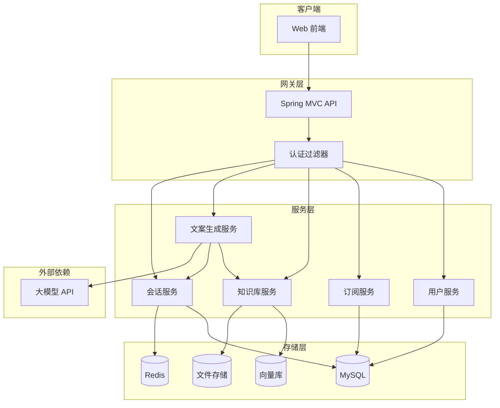
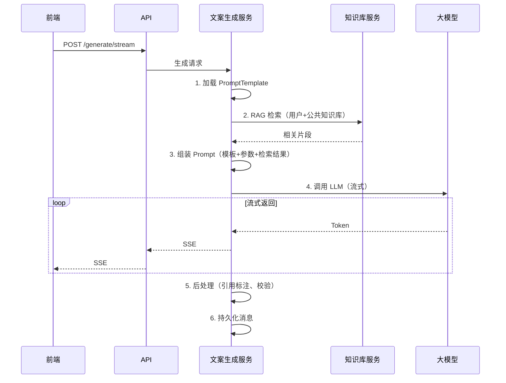

# 幼儿园老师 Agent 后端技术规格

## 1. 技术栈

| 类别 | 技术选型 | 版本 |
|------|----------|------|
| 框架 | Spring Boot | 3.x |
| 安全 | Spring Security + JWT | - |
| 持久化 | Spring Data JPA | - |
| 数据库 | MySQL / PostgreSQL | 8.x / 15.x |
| 缓存 | Redis | 6.x+ |
| 向量检索 | Milvus / pgvector / Elasticsearch | - |
| 文件存储 | 本地 / MinIO / OSS | - |
| 大模型 | OpenAI API / 通义千问 / 文心一言 等 | 多模型抽象 |
| 文档解析 | Apache Tika / PDFBox | - |

---

## 2. 系统架构

### 2.1 架构图



### 2.2 模块划分

| 模块 | 职责 |
|------|------|
| 用户服务 | 注册、登录、个人资料、Token 管理 |
| 订阅服务 | 套餐、订阅、订单、用量统计 |
| 知识库服务 | 文件上传、解析、向量化、RAG 检索 |
| 文案生成服务 | Prompt 组装、LLM 调用、流式输出、后处理 |
| 会话服务 | 对话会话、消息历史、上下文管理 |

---

## 3. 数据模型

### 3.1 核心实体

**User（用户）**

| 字段 | 类型 | 说明 |
|------|------|------|
| id | Long | 主键 |
| phone | String | 手机号 |
| email | String | 邮箱 |
| passwordHash | String | 密码哈希 |
| nickname | String | 昵称 |
| avatar | String | 头像 URL |
| role | Enum | 角色 |
| status | Enum | 状态 |
| createdAt | LocalDateTime | 创建时间 |
| updatedAt | LocalDateTime | 更新时间 |

**Subscription（订阅）**

| 字段 | 类型 | 说明 |
|------|------|------|
| id | Long | 主键 |
| userId | Long | 用户 ID |
| planId | String | 套餐 ID |
| planName | String | 套餐名称 |
| status | Enum | 有效/过期/取消 |
| startAt | LocalDateTime | 开始时间 |
| endAt | LocalDateTime | 结束时间 |
| dailyQuota | Integer | 每日额度（-1 不限） |
| createdAt | LocalDateTime | 创建时间 |

**KnowledgeFile（知识库文件）**

| 字段 | 类型 | 说明 |
|------|------|------|
| id | Long | 主键 |
| userId | Long | 用户 ID |
| fileName | String | 原始文件名 |
| filePath | String | 存储路径 |
| fileSize | Long | 文件大小 |
| mimeType | String | MIME 类型 |
| status | Enum | 解析中/已完成/失败 |
| chunkCount | Integer | 分块数量 |
| createdAt | LocalDateTime | 创建时间 |
| updatedAt | LocalDateTime | 更新时间 |

**Session（对话会话）**

| 字段 | 类型 | 说明 |
|------|------|------|
| id | Long | 主键 |
| userId | Long | 用户 ID |
| title | String | 会话标题（可自动生成） |
| docTypeId | String | 文案类型 ID |
| createdAt | LocalDateTime | 创建时间 |
| updatedAt | LocalDateTime | 更新时间 |

**Message（消息）**

| 字段 | 类型 | 说明 |
|------|------|------|
| id | Long | 主键 |
| sessionId | Long | 会话 ID |
| role | Enum | user / assistant |
| content | Text | 消息内容 |
| metadata | JSON | 参数、引用等 |
| createdAt | LocalDateTime | 创建时间 |

**PromptTemplate（Prompt 模板）**

| 字段 | 类型 | 说明 |
|------|------|------|
| id | String | 文案类型 ID |
| name | String | 显示名称 |
| category | String | 分类 |
| systemPrompt | Text | 系统 Prompt |
| userPromptTemplate | Text | 用户 Prompt 模板（含占位符） |
| defaultParams | JSON | 默认参数 |
| enabled | Boolean | 是否启用 |
| updatedAt | LocalDateTime | 更新时间 |

---

## 4. API 设计

### 4.1 认证相关

| 方法 | 路径 | 说明 |
|------|------|------|
| POST | /api/auth/register | 注册（手机/邮箱） |
| POST | /api/auth/login | 登录 |
| POST | /api/auth/logout | 登出 |
| POST | /api/auth/refresh | 刷新 Token |
| GET | /api/auth/me | 获取当前用户信息 |

### 4.2 用户相关

| 方法 | 路径 | 说明 |
|------|------|------|
| PUT | /api/users/me | 更新个人资料 |
| PUT | /api/users/me/password | 修改密码 |

### 4.3 订阅相关

| 方法 | 路径 | 说明 |
|------|------|------|
| GET | /api/subscriptions/plans | 套餐列表 |
| GET | /api/subscriptions/me | 当前订阅状态 |
| POST | /api/subscriptions/orders | 创建订阅订单 |
| GET | /api/subscriptions/orders | 订单列表 |
| GET | /api/subscriptions/usage | 用量统计 |

### 4.4 会话相关

| 方法 | 路径 | 说明 |
|------|------|------|
| GET | /api/sessions | 会话列表（分页） |
| POST | /api/sessions | 创建会话 |
| GET | /api/sessions/{id} | 会话详情（含消息） |
| PUT | /api/sessions/{id} | 更新会话（标题等） |
| DELETE | /api/sessions/{id} | 删除会话 |

### 4.5 文案生成相关

| 方法 | 路径 | 说明 |
|------|------|------|
| GET | /api/doc-types | 文案类型列表（树形） |
| POST | /api/generate | 生成文案（同步，短文案） |
| POST | /api/generate/stream | 生成文案（流式，SSE） |

**生成请求体示例：**

```json
{
  "sessionId": 123,
  "docTypeId": "lesson-plan",
  "userInput": "小班科学活动：认识水果",
  "params": {
    "ageGroup": "小班",
    "style": "活泼",
    "wordCount": 600,
    "useKnowledgeBase": true
  }
}
```

### 4.6 知识库相关

| 方法 | 路径 | 说明 |
|------|------|------|
| POST | /api/knowledge/files | 上传文件 |
| GET | /api/knowledge/files | 文件列表 |
| GET | /api/knowledge/files/{id} | 文件详情 |
| DELETE | /api/knowledge/files/{id} | 删除文件 |
| GET | /api/knowledge/files/{id}/status | 解析状态 |

---

## 5. 文案生成核心流程

### 5.1 流程说明



### 5.2 步骤说明

1. **加载 Prompt 模板**：按 `docTypeId` 获取系统 Prompt 与用户 Prompt 模板。
2. **RAG 检索**：若 `useKnowledgeBase=true`，检索用户私有知识库；同时检索幼教领域公共知识库；取 Top-K 片段。
3. **组装 Prompt**：将模板占位符替换为参数、检索结果、用户输入。
4. **调用 LLM**：通过统一抽象接口调用具体模型，支持流式输出。
5. **后处理**：对输出做引用标注、基本校验（如长度、格式）。
6. **持久化**：保存 user message 与 assistant message 到数据库。

### 5.3 RAG 检索策略

- 用户输入 + 文案类型作为 Query
- 向量相似度检索（如 Top-5）
- 公共知识库：幼教教材、政策、规范等预置数据
- 私有知识库：用户上传文件经分块、向量化后的数据

### 5.4 引用与幻觉控制

- 在 Prompt 中明确要求「仅基于给定参考资料回答，不确定时标注」。
- 输出中检测 `[来源:xxx]` 等格式，解析后以结构化方式展示。
- 可选：对关键事实做后校验（如政策名称、年龄划分）。

---

## 6. 大模型接入抽象

### 6.1 接口定义

```java
public interface LLMProvider {
    // 同步调用
    String chat(List<ChatMessage> messages, ChatOptions options);
    // 流式调用
    Flux<String> chatStream(List<ChatMessage> messages, ChatOptions options);
}

public interface ChatMessage {
    String getRole();  // system / user / assistant
    String getContent();
}

public interface ChatOptions {
    String getModel();
    Double getTemperature();
    Integer getMaxTokens();
}
```

### 6.2 实现

- `OpenAIProvider`：对接 OpenAI / 兼容 API
- `QwenProvider`：通义千问
- `WenxinProvider`：文心一言
- 通过配置选择当前 Provider 和 model

### 6.3 重试与降级

- 请求失败时重试 2 次，指数退避
- 主模型超时或失败时，可降级到备用模型
- 流式超时时间建议 60–90 秒

---

## 7. 安全设计

- 所有 API 除 `/api/auth/login`、`/api/auth/register` 外需 JWT 校验
- 敏感接口（修改密码、订阅）需二次校验
- 文件上传：限制类型（PDF、Word、TXT）、大小（单文件 ≤ 10MB）、病毒扫描（可选）
- 限流：按用户/IP 限制 QPS，订阅等级可区分额度

---

## 8. 部署与配置

### 8.1 部署架构建议

```
[负载均衡] -> [应用实例 × N] -> [MySQL 主从] / [PostgreSQL]
                          -> [Redis 集群]
                          -> [向量库]
                          -> [文件存储]
```

### 8.2 关键配置项

```yaml
# application.yml 示例
spring:
  datasource:
    url: jdbc:mysql://...
  data:
    redis:
      host: ...
      port: 6379

llm:
  provider: openai  # openai / qwen / wenxin
  api-key: ${LLM_API_KEY}
  model: gpt-4
  fallback-model: gpt-3.5-turbo

rag:
  public-knowledge-base: ...
  top-k: 5

file:
  storage-path: /data/uploads
  max-size: 10485760  # 10MB
```

### 8.3 启动顺序

1. MySQL / PostgreSQL、Redis、向量库、文件存储
2. 应用服务
3. 如有定时任务（如用量统计、文件解析队列），一并启动
